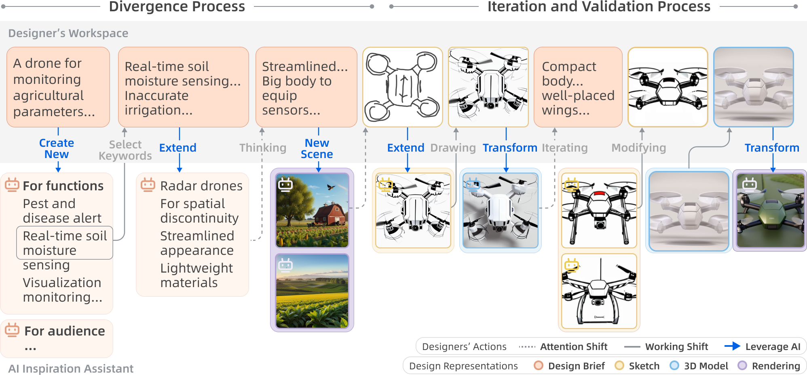
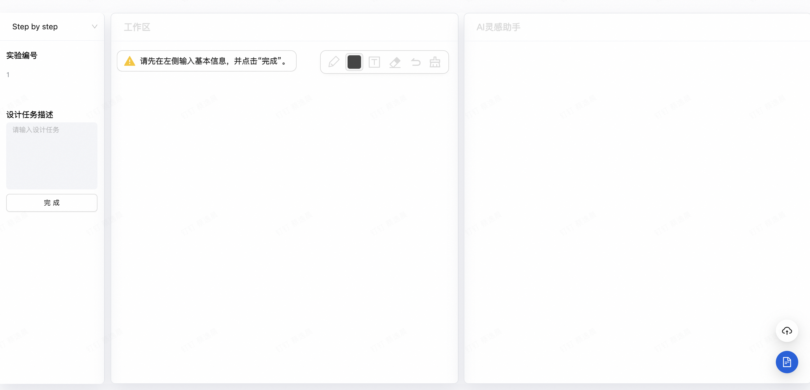

# StepIdeator
## Introduction

To support product conceputal design, We implemented StepIdeator, which supports mixed representation within an environment that includes design briefs, sketches, models, and renderings . This AI-based system is designed to provide specific inspiration, make design concepts tangible, and facilitate effortless navigation among different representations. 




## Installation

To install `StepIdeator`, follow these steps:

1. Clone the repository:
    ```bash
    git clone URL_ADDRESS
    ```
2. Install dependencies of Python:
    - Enter the `StepIdeator-API` directory:
    - Set up the environment and install dependencies using Conda:
        ```bash
        conda env create -f environment.yml \
        conda activate $env_name
        ```
3. Run Python application:
    ```bash
    python app.py
    ```
4. Make sure you have Node.js installed. 
    You can download and install the version that fits your operating system from https://nodejs.org
5. Install dependencies of user interface:
    - Enter the `StepIdeator-UserInterface` directory
    - Install dependencies using yarn:
        ```bash
        yarn install
        ```
6. Run user interface:
    ```bash
    yarn dev
    ```
7. Open the application in your browser.

    

## License

This project is licensed under the MIT License. See the [LICENSE](LICENSE) file for details.

## Contact

For any questions or inquiries, please contact Yichen Cai (yichencai@zju.edu.cn) .